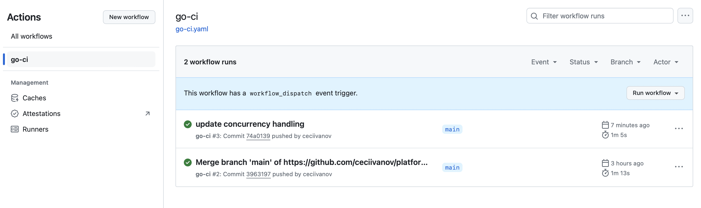
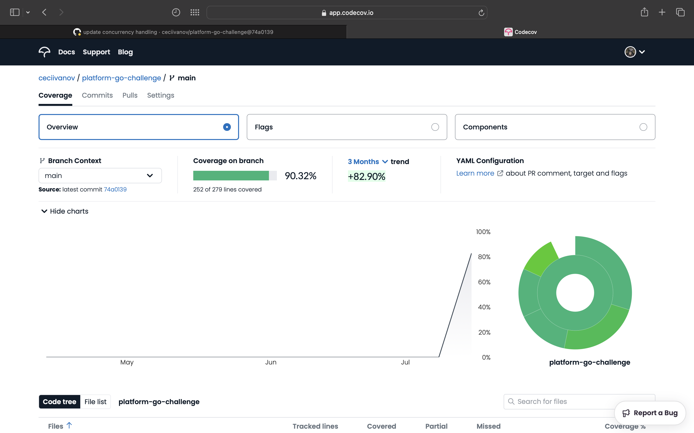

# GlobalWebIndex Engineering Challenge

The GlobalWebIndex Engineering Challenge is an application designed to manage user data and their favorite assets, including charts, insights, and audience profiles. It showcases practical backend development principles and aims to demonstrate a modular approach to application architecture.

## Table of Contents

- [Overview](#overview)
- [Project Structure](#project-structure)
- [Dependencies](#dependencies)
- [Setup and Installation](#setup-and-installation)
  - [Running Locally](#running-locally)
  - [Using Docker](#using-docker)
- [Usage](#usage)
  - [Endpoints](#endpoints)
  - [Examples](#examples)
- [Testing](#testing)
- [Performance](#performance)
  - [Benchmarking](#benchmarking)  
- [Concurrency Handling](#concurrent-handling)
- [Continuous Integration with GitHub Actions](#continuous-integration-with-github-actions)

---

## Overview

The project implements a backend service (API) that allows users to:

- Retrieve a list of their favorite assets categorized into charts, insights, and audience profiles.
- Add new assets to their favorites.
- Remove existing assets from their favorites.
- Update details of existing favorite assets.

## Project Structure

The project is organized into the following directories:

- `cmd/`: Contains the main application entry point.
- `internal/models`: Contains the data models used in the application. 
- `internal/repository`: Handles data storage and retrieval operations. Implements an in-memory data store and any future data storage mechanisms.
- `internal/handlers`: Implements HTTP request handlers for the API endpoints.
- `internal/service`: Implements business logic and interacts with repositories.
- `internal/utils`: Contains utility functions, like decoding JSON data.
- `scripts/`: Contains example scripts for interacting with the API.
- `json/`: Contains sample data for users and assets. Can be used to run examples.


## Dependencies

The project leverages Go language features and standard libraries. Additionally, it uses some third-party libraries for routing and testing.

- Go version - go1.22.4
- Third-party libraries
    - github.com/gorilla/mux
    - github.com/stretchr/testify


## Setup and Installation

Explain how to set up and install your project.

### Running Locally

To run the application locally, follow these steps:

1. Clone the repository:

```bash
git clone https://github.com/ceciivanov/platform-go-challenge.git
``` 

2. Change into the project directory:

```bash
cd platform-go-challenge
git checkout implementation
```

3. Build the application:

```bash
go mod tidy
go build -o app cmd/app/main.go
```

4. Run the application:

```bash
./app
```

The application will start on port `8080` by default. You can access the API at `http://localhost:8080`.

5. To stop the application, press `Ctrl + C` in the terminal where the app is running.


### Using Docker

To run the application using Docker, follow these steps:

1. Build the Docker image:

```bash
docker build -t platform-go-challenge .
```

2. Run the Docker container:

```bash
docker run -p 8080:8080 platform-go-challenge
```

The application will start inside a Docker container and be accessible at `http://localhost:8080`.

3. To stop and delete the container, use the following command:

```bash
docker container stop <container_id>
docker container rm <container_id>
```

Replace `<container_id>` with the ID of the running container. You can find the container ID by running `docker ps -a`.

4. To delete the Docker image, use the following command:

```bash
docker rmi platform-go-challenge
```


## Usage

The application exposes RESTful endpoints for interacting with user data and favorite assets. Examples of API requests are provided to demonstrate functionality and usage scenarios.

### Endpoints

The API provides the following endpoints:

- `GET /users/{userID}/favorites`: Retrieve a list of favorite assets for a user. Expected response is a JSON array of assets.
- `POST /users/{userID}/favorites`: Add a new asset to a user's favorites. Expected response is a JSON object representing the added asset.
- `PUT /users/{userID}/favorites/{assetID}`: Update details of an existing favorite asset. Expected response is a JSON object representing the updated asset.
- `DELETE /users/{userID}/favorites/{assetID}`: Remove an existing asset from a user's favorites. No response body is expected.

### Examples

The following examples demonstrate how to interact with the API using `curl` commands. There are examples include successful and unsuccessful requests to showcase the API's behavior in different scenarios. You can find them written as bash script in the `/scripts/examples.sh` file. Suggesting to run the commands one by one in the terminal in the order they are written in the script.

```bash
# GET existing user favorites
curl -X GET http://localhost:8080/users/1/favorites

# GET user favorites which do not exist
curl -X GET http://localhost:8080/users/999999/favorites

# DELETE existing user favorite
curl -X DELETE http://localhost:8080/users/1/favorites/1

# DELETE user favorite which does not exist
curl -X DELETE http://localhost:8080/users/1/favorites/999999

# ADD valid user favorite
curl -X POST http://localhost:8080/users/1/favorites \
     -H "Content-Type: application/json" \
     -d '{
          "id": 100,
          "type": "Audience",
          "description": "This audience is a 40 year old",
          "age": 40,
          "ageGroup": "25-45",
          "gender": "Male",
          "birthCountry": "USA",
          "hoursSpentOnMedia": 4,
          "numberOfPurchases": 10
         }'

# ADD user favorite which already exists
curl -X POST http://localhost:8080/users/1/favorites \
     -H "Content-Type: application/json" \
     -d '{
          "id": 2,
          "type": "Insight",
          "description": "Sample Insight for testing",
          "text": "Testing Insight"
         }'

# ADD user favorite with invalid type
curl -X POST http://localhost:8080/users/1/favorites \
     -H "Content-Type: application/json" \
     -d '{
          "id": 200,
          "type": "INVALIDTYPE",
          "description": "Sample Insight for testing",
          "text": "Testing Insight"
         }'

# EDIT the previously added user favorite
curl -X PUT http://localhost:8080/users/1/favorites/100 \
     -H "Content-Type: application/json" \
     -d '{
          "id": 100,
          "type": "Audience",
          "description": "Updated Audience",
          "age": 18,
          "ageGroup": "18-25",
          "gender": "Female",
          "birthCountry": "Greece",
          "hoursSpentOnMedia": 15,
          "numberOfPurchases": 25
         }'

# EDIT user favorite with mismatched id (assetID in URL and id in body)
curl -X PUT http://localhost:8080/users/2/favorites/2 \
     -H "Content-Type: application/json" \
     -d '{
          "id": 1,
          "type": "Insight",
          "description": "Sample Insight for testing",
          "text": "Testing Insight"
         }'

# EDIT user favorite with mismatched type
curl -X PUT http://localhost:8080/users/1/favorites/100 \
     -H "Content-Type: application/json" \
     -d '{
          "id": 100,
          "type": "Insight",
          "description": "Sample Insight for testing",
          "text": "Testing Insight"
         }'
```


## Testing

The project includes unit tests for the service and repository layers. The tests are implemented using the Go standard library and the `testify` library for assertions.

To run the tests, execute the following command:

```bash
go test -v ./... -coverprofile=coverage.out
```

To view the test coverage report in html format on your browser, install the `go tool cover` package and run the following command:

```bash
go tool cover -html=coverage.out
```

## Performance

The project's performance is optimized for handling operations on user's favorite assets by using an in-memory data store. The data is mapped to Go structs (Users, Assets), and maps are used for fast lookups. This design ensures that the time complexity of the operations (get, add, update, delete) is O(1). 

#### Current Performance Characteristics

- `In-Memory Data Store`: Using maps to store users and assets allows for constant-time complexity (O(1)) for CRUD operations. This means that the operations are executed very quickly, regardless of the number of users or assets in the system.

- `Initialization Overhead`: While CRUD operations are fast, initializing large datasets can take significant time. This is because the sample data generation involves nested loops to create users and their associated assets, which increases the time complexity of the initialization process.

### Benchmarking

The project includes benchmark tests for the handler layer. Multiple benchmarks are implemented to measure the performance of the API endpoints under different scenarios.

To run the benchmarks, execute the following command:

```bash
go test -bench=. ./internal/handlers
```

The benchmarks will run and display the results, including the number of operations per second and the time taken for each operation.


## Concurrency Handling

### Problem Statement

When multiple operations such as adding, deleting, editing, or retrieving user favorites are performed concurrently, it can lead to race conditions. This occurs because the Go map type is not thread-safe, meaning concurrent read and write operations on a map can cause unexpected behavior and data corruption.

### Solution

To address this issue, concurrency control is implemented using `sync.RWMutex`. This approach ensures that the in-memory data structure can handle concurrent access without running into race conditions. 

`RWMutex` provides a mechanism to allow multiple read operations to occur simultaneously while ensuring that that write operations have exclusive access.

- `Lock()`: Acquired before performing write operations to ensure exclusive access.
- `Unlock()`: Released after the write operation is complete.
- `RLock()`: Acquired before performing read operations to allow multiple readers.
- `RUnlock()`: Released after the read operation is complete.

These methods are used in the `InMemoryUserRepository` operations to ensure that:
- `Add`, `Edit` and `Delete` operations lock the repository for writing to ensure exclusive access during the modification.
- `Get` operation locks the repository for reading, allowing concurrent read operations but ensuring no write operations occur simultaneously.

### Tests
To verify the thread safety and correctness of our implementation, concurrent tests are included for each of these operations. These tests simulate multiple goroutines performing the same operation concurrently and check for data consistency and absence of race conditions.

To run the concurrent tests, execute the following command:

```bash
go test -race ./...
```

## Continuous Integration with GitHub Actions

This project uses GitHub Actions for continuous integration to ensure that all code changes are built, tested, and code coverage metrics are published. The CI workflow can be triggered manualy (workflow_dispatch event) or automatically on every push to the main branch even on pull requests targeting the main branch. Of course these settings can be changed in the `.github/workflows/ci.yml` file.

### Overview of CI Workflow

The CI pipeline performs the following steps:

- Checkout Code: Checks out the code from the repository.
- Set Up Go: Sets up the specified version of Go.
- Install Dependencies: Installs project dependencies.
- Build: Builds the project.
- Run Tests: Runs unit tests with race detection and coverage profiling.
- Convert Coverage Report: Converts the Go coverage report to Cobertura format.
- Upload Coverage to Codecov: Uploads the coverage report to Codecov. (My Personal Codecov account using github is used and a generated token as github secret)
- Generate Code Coverage Report: Generates a coverage summary report.
- Add Coverage PR Comment: Adds a comment to the pull request with the coverage results.

By implementing this CI pipeline, the project ensures that all code changes are tested and that the coverage results are visible to the developers.

In the following screenshot you can see how to run the workflow manually.



### Example of Coverage Report

Following some screenshots of the coverage report generated by the CI pipeline:



